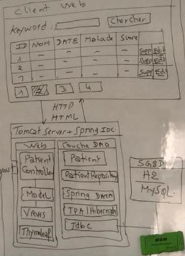

<h2>Compte rendu</h2>

<h2>Application des Gestion des Patients</h2>
<h3>Introduction</h3>

Création d'une Application web basée sur Spring MVC,Thymeleaf et Spring DATA JPA , qui permet de gérer des Patients.

<h3> Conception :</h3>

<h3>Exécution</h3>
